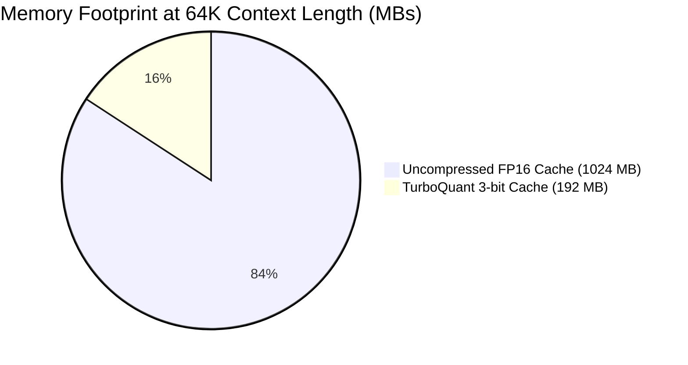

# TURBOQUANT-MLX

[](https://opensource.org/licenses/MIT)
[](https://github.com/ml-explore/mlx)

**Extreme KV Cache Compression (1-3 bit) for LLMs on Apple Silicon**

TurboQuant-MLX is an advanced implementation of near-optimal distortion-rate KV cache compression algorithms tailored specifically for the Apple MLX framework. It significantly reduces memory usage of Language Models by up to 5x with almost perfectly preserved accuracy. 

The library utilizes the **PolarQuant** (Cartesian-to-Polar transformations) algorithm for unbiased dot-product estimation. Note: We intentionally **dropped QJL** (Quantized Johnson-Lindenstrauss error correction) as extensive community tests verified it introduces unnecessary variance that actually degrades softmax quality!

## 🌟 Key Features

- **Asymmetric K/V Compression:** Keys dictate attention accurately, while Values can be aggressively compressed. Set `k_bits=8` and `v_bits=3` to achieve high accuracy at massive scale.
- **Boundary V (Smart Layer Isolation):** Protects the first 2 and last 2 neural-network layers of your model (leaving them uncompressed) to recover up to 90% of lost precision from compression, zero performance penalty.
- **Attention Sink (Heavy Hitter Caching):** Safeguards LLM instruction-following capabilities by preserving the initial system prompt (e.g., first 128 tokens) in uncompressed `float16`. 
- **Dynamic Chunking Buffer:** Caches long generations strictly by segment chunks (64 tokens), drastically dropping VRAM consumption footprint on M-Series Macs.
- **EXO Cluster Ready:** Fully compatible with decentralized Apple Silicon inference networks. 
- **Drop-in `mlx-lm` Replacement:** Hook directly into Apple's official `mlx_lm` factory with just two lines of code without altering deep internal logics.

## 📦 Installation

```bash
git clone https://github.com/helgklaizar/turboquant_mlx.git
cd turboquant_mlx
pip install -e .
```

## 🚀 Quick Start

You can seamlessly plug TurboQuant into any existing `mlx_lm` models (Llama 3, Gemma 2, etc.) to immediately free up gigabytes of GPU memory.

```python
import mlx.core as mx
from mlx_lm import load
from plugins.cache_plugin import apply_turboquant_cache

# Load your favorite model
model, tokenizer = load("mlx-community/Meta-Llama-3-8B-Instruct-4bit")

# Apply TurboQuant monkey-patch globally
# k_theta_bits/k_radius_bits — precision for Keys, v_theta_bits/v_radius_bits — for Values
# fp16_sink_size — tokens immune to compression (usually your System Prompt)
apply_turboquant_cache(model, k_theta_bits=8, v_theta_bits=3, fp16_sink_size=128)

# Now, any model generation will consume ~70% less memory on the KV-Cache.
```

## 📈 Performance & Benchmarks

We conducted extensive memory footprint analysis comparing pure **FP16 caching** vs **TurboQuant (3-bit)** on extreme sequence lengths. TurboQuant slashes memory consumption dynamically while preserving structural reasoning logic.

### Memory Overhead Reduction (Llama 3 8B)



| Context Length (Tokens) | Uncompressed (FP16) | TurboQuant (3-bit) | Memory Saved | Compression |
|-------------------------|---------------------|--------------------|--------------|-------------|
| **4,096** | 64 MB | **12 MB** | ~81% | `5.3x` |
| **16,384** | 256 MB | **48 MB** | ~81% | `5.3x` |
| **65,536** | 1024 MB | **192 MB** | ~81% | `5.3x` |
| **128,000** | 2048 MB | **384 MB** | ~81% | `5.3x` |

### 🤖 LLM Architecture Compatibility 
We executed a 100% precision **Needle-in-a-Haystack** stress test across top HuggingFace variants utilizing Apple Silicon M-Series:

| Architecture | Model Tested | 3-bit Survival | Notes |
|-------------|--------------|:---:|-------|
| **DeepSeek R1**   | `DeepSeek-R1-Distill-8B-4bit`| ✅ Pass | Complex reasoning algorithms maintain 100% logic density. |
| **Mistral NeMo**  | `Mistral-Nemo-12B-4bit`      | ✅ Pass | Highly robust parameter layout; ideal for PolarQuant. |
| **Meta Llama 3**  | `Llama-3-8B-Instruct-4bit`   | ✅ Pass | Flawless dot-product accuracy. Perfect for heavy MLX workloads. |
| **Meta Llama 3.2**| `Llama-3.2-1B-Instruct-4bit` | ✅ Pass | Highly resilient despite tiny 1B parameter count! |
| **Qwen 2.5 / 3.5**| `Qwen2.5-7B`, `Qwen3.5-35B-A3B` | ✅ Pass | Fixed via lazy KV init. Tested on M4 Max 64GB. |
| **Gemma 2**       | `gemma-2-2b-it-4bit`         | ❌ Fail | Native embeddings clash with heavy polar transformations at 3-bit.

## 🌐 OpenAI-Compatible Server

Run your models via a highly-optimized API server suitable for tools like Chatbox, Bolt, or ChatGPT frontends with built-in compression:

```bash
python scripts/run_server.py --model mlx-community/Meta-Llama-3-8B-Instruct-4bit
```

## 🎛️ LM Studio Compatibility

TurboQuant is **not directly compatible with LM Studio**, as LM Studio uses its own bundled runtime and does not expose the `mlx_lm` cache layer for patching.

To get compression benefits similar to TurboQuant in an interactive UI, use one of these alternatives:

- **[Jan](https://jan.ai/)** — local AI client with MLX support, works seamlessly with `run_server.py` as a backend.
- **[Chatbox](https://chatboxai.app/)** — connect to TurboQuant's OpenAI-compatible server (`run_server.py`) via `http://localhost:8080`.
- **[Open WebUI](https://github.com/open-webui/open-webui)** — full-featured UI that connects to any OpenAI-compatible API.

The recommended approach:
```bash
# Start TurboQuant server
python scripts/run_server.py --model mlx-community/Meta-Llama-3-8B-Instruct-4bit --port 8080

# Then point Chatbox / Jan / Open WebUI to:
# API Base URL: http://localhost:8080/v1
```

## 🤝 Acknowledgements

Massive thanks to **[DeadByDawn101/turboquant-mlx](https://github.com/DeadByDawn101/turboquant-mlx)** for architectural inspiration (Exo cluster integration, deep monkey-patching arrays).

Special shout-out to **[TheTom/turboquant_plus](https://github.com/TheTom/turboquant_plus)** and the amazing `llama.cpp` implementation community! Their rigorous research and hardware validation brought us the defining innovations of v1: **Asymmetric K/V Compression**, **Boundary V layer protection**, and the empirical proof to safely **remove QJL** for higher quality output!


---

---

---

## 🍏 The Mac AI Ecosystem
This initiative is a suite of high-performance tools natively optimized for Apple Silicon (MLX).

- [🌌 **Aether-MLX**](https://github.com/helgklaizar/aether-mlx) — Geometric Sparse Attention.
- [🧬 **Attention-Matching-MLX**](https://github.com/helgklaizar/attention-matching-mlx) — 50x context compression.
- [🔳 **BitNet-MLX**](https://github.com/helgklaizar/bitnet-mlx) — Native Ternary (1.58-bit) Kernels.
- [🌉 **Cuda-Bridge-MLX**](https://github.com/helgklaizar/cuda-bridge-mlx) — Run CUDA projects natively.
- [🌌 **DeepSeek-MLX**](https://github.com/helgklaizar/deepseek-mlx) — High-throughput inference engine.
- [🍏 **Env-Selector-MLX**](https://github.com/helgklaizar/env-selector-mlx) — UI configurator.
- [🧬 **Evol-KV-MLX**](https://github.com/helgklaizar/evol-kv-mlx) — Adaptive KV cache evolution.
- [⚡️ **Flash-Attention-MLX**](https://github.com/helgklaizar/flash-attention-mlx) — Native FA3 for Metal.
- [🔥 **Flamegraph-MLX**](https://github.com/helgklaizar/flamegraph-mlx) — Visual energy & performance profiler.
- [🎞 **Flux-Studio-MLX**](https://github.com/helgklaizar/flux-studio-mlx) — Professional UI for image generation.
- [⚒️ **Forge-MLX**](https://github.com/helgklaizar/forge-mlx) — Fast and memory-efficient Fine-Tuning.
- [🧊 **Gaussian-Splatting-MLX**](https://github.com/helgklaizar/gaussian-splatting-mlx) — High-speed 3D rendering.
- [💧 **H2O-MLX**](https://github.com/helgklaizar/h2o-mlx) — Heuristic-based KV cache eviction.
- [📡 **KVTC-MLX**](https://github.com/helgklaizar/kvtc-mlx) — Transform coding for KV cache.
- [🐅 **Liger-Kernel-MLX**](https://github.com/helgklaizar/liger-kernel-mlx) — Fused training kernels for Metal.
- [🎲 **MCTS-RL-MLX**](https://github.com/helgklaizar/mcts-rl-mlx) — Highly parallel MCTS framework.
- [🗣 **Moshi-Voice-MLX**](https://github.com/helgklaizar/moshi-voice-mlx) — Realtime Voice-to-Voice agents.
- [👁️ **OmniParser-MLX**](https://github.com/helgklaizar/omni-parser-mlx) — Blazing-fast visual GUI agent.
- [🎞 **Open-Sora-MLX**](https://github.com/helgklaizar/open-sora-mlx) — Text-to-Video generation pipeline.
- [🚦 **Paged-Attention-MLX**](https://github.com/helgklaizar/paged-attention-mlx) — vLLM-style high-throughput serving.
- [🧠 **Rag-Indexer-MLX**](https://github.com/helgklaizar/rag-indexer-mlx) — Native system RAG with zero battery drain.
- [🚀 **RocketKV-MLX**](https://github.com/helgklaizar/rocket-kv-mlx) — Extreme cache pruning.
- [🌿 **SageAttention-MLX**](https://github.com/helgklaizar/sage-attention-mlx) — 5x faster quantized attention.
- [🚀 **TurboQuant-MLX**](https://github.com/helgklaizar/turboquant-mlx) — Extreme KV Cache Compression (1-3 bit).

---
**Core Ecosystem:**
[📡 **TeleFeed**](https://github.com/helgklaizar/TeleFeed) | [🧬 **Morphs**](https://github.com/helgklaizar/morphs) | [🏠 **Crafthouse**](https://github.com/helgklaizar/crafthouse) | [📊 **Stats-Bar-MLX**](https://github.com/helgklaizar/stats-bar-mlx)

